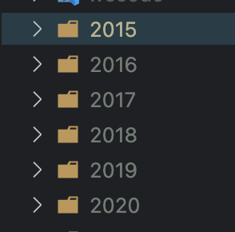
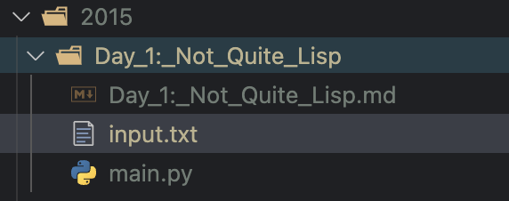
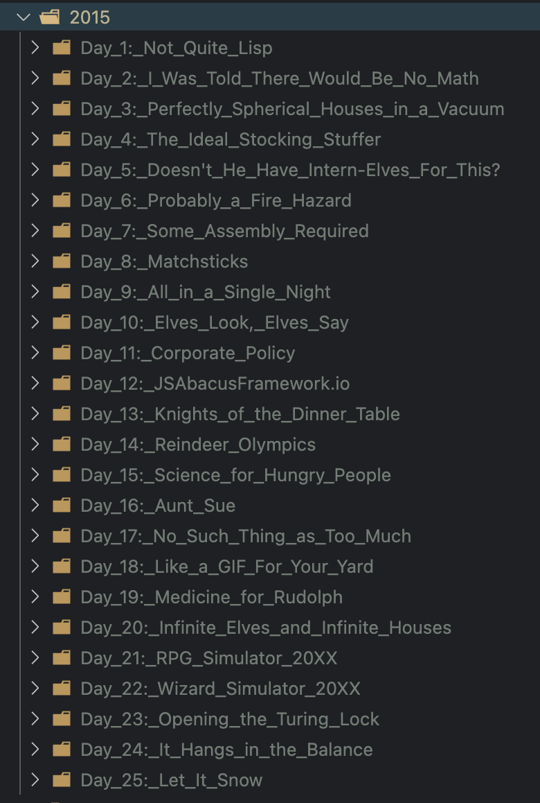
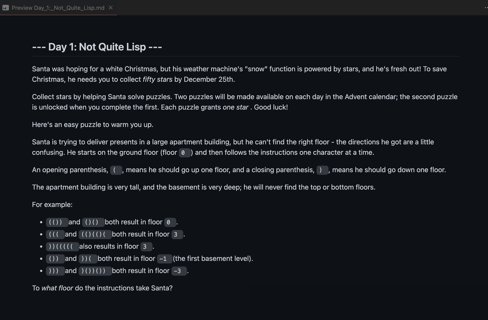

# Hi there! I'm Michelle Scott
 

 

 

 

<!--   
 <video src='https://user-images.githubusercontent.com/45644361/201426613-06a30125-bc68-409c-bd70-697d2472d0ab.mp4'></video>
   
 

  -->

### Tryhackme 

My progress so far since April 10, 2023

<!--  -->

Visit my profile on 

||||
|---------------|---------------|-------------|
||||
||||
||
||

|||
|---|---|
|||

 
### Frontend Masters
 
 
[My Profile Frontend Masters](https://frontendmasters.com/u/scottmm374/)
 
 
 

### CS50
  
 

 <h2>CS50P Python</h2> 

 

 

  <h2>CS50X Computer Science</h2>

 

 
 ### Codesmith.io
   
  

 

# Some projects I have done

[Advent_puzzles_scraper Repo](https://github.com/scottmm374/Advent_puzzles_scraper)

#### About
Web scraper and directory/file generator to save previously released Advent of Code puzzles in a single location. 

#### Features
- Creates directories labeled by year for previous puzzles available on Advent of Code (2015-2020)
- Creates sub directories labeled by puzzle title inside each year directory. (25)
- Creates .txt file for puzzle input (optional)
- Creates .md file with Puzzle instructions scraped from website.
- Creates a .py file (For solving) :)

#### Tech 
- Python3
- beautifulsoup4
- requests
- urllib / pathlib / os
 

#### Screenshots

<table width='100%' align='center'>
<tr>
<td></td>
<td></td>
</tr>
<tr>
<td></td>
<td></td>
</tr>
</table>

 <h2 align='center'>Favorite tech</h2>
<table width='100%' align='center'>
<tr>
<td></td>
<td></td>
<td></td>
</tr>
</table>
 
 <h2 align='center'>Other Techie Tools</h2>
<table width='100%' align='center'>
<tr>
<td></td>
<td></td>
<td></td>
<td></td>
<td></td>
<td></td>
</tr>
</table>
 

<!-- https://www.visitorbadge.io/  Get your badge here-->

