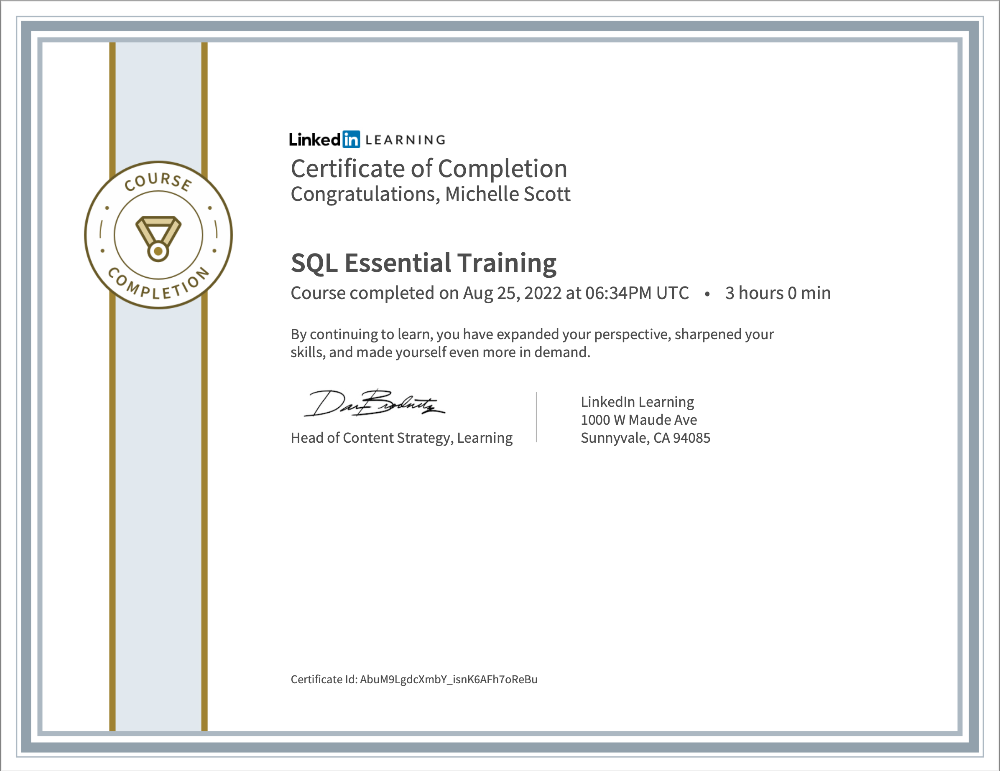

##  Welcome to my Github page! My name is Michelle Scott! 

### ABOUT ME

 

 CERTIFICATIONS, LEARNING 
 

[MUFI](https://torpid-anise-217.notion.site/MUFI-a1db36f1b6374be083e8c08a3fa9cd27)

# Featured Projects:

Save this Job
  

  [Front-End-Repo](https://github.com/Lambda-School-Labs/job-book-fe)|
  [Back-End-Repo](https://github.com/Lambda-School-Labs/job-book-be)| 
  [Extention-Repo](https://github.com/Lambda-School-Labs/job-book-chrome-ext)|

  

#### Kanban

<!-- ## Conway's Game of Life:

[Game-Of-Life-Repo](https://github.com/scottmm374/game-of-life)|

[Play Game of Life](https://game-of-life.scottmm374.vercel.app)

 -->

<h2 align='center'>Favorite Programming Languages</h2>
<table width='100%' align='center'>
<tr>
<td></td>
<td></td>
<td></td>
</tr>

</table>
 
 <h2 align='center'>Other Techie Tools</h2>
<table width='100%' align='center'>
<tr>
<td></td>
<td></td>
<td></td>
<td></td>
<td></td>
<td></td>
</tr>
</table>

 
<h2 align='center'>Find me on</h2>
<table width='100%' align='center'>
<tr>
<td></td>
<td></td>
<td></td>
<td></td>
<td></td>
<td></td>
</tr>
</table>

