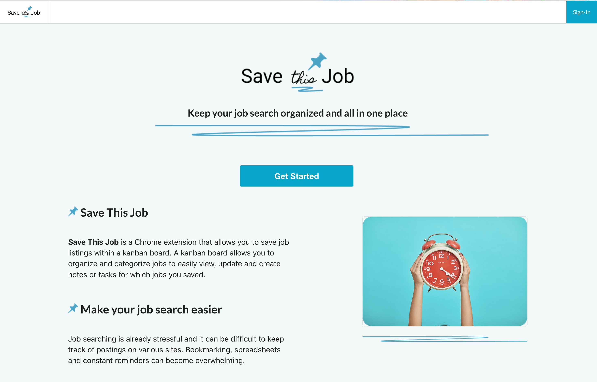

### Hi there :raising_hand_woman: 
### Welcome to my Github page! I am Michelle Scott! :cherry_blossom:

 

#### 🌱 Things I am currently working on: 
- Reviewing React, Redux, Testing(Jest, Cypress)
- Visual Tutorials on common data structures, algorithms, and traversals for beginner/intermediate

#### Things I am challenging myself with:
- Learning Cypress for testing
- Learning Data Structures and their uses (Python), and translating to Javascript for use in React Applications.
- Learning algorithms, and traversals of different Data structures. 

#### :computer: Programming languages and tools: 
- Html, CSS
- Javascript
- Node.js
- Python (My current Favorite language)

	
## Featured Projects:

<!-- Here are some ideas to get you started:

<!--- 🔭 I’m currently working on ...
<!--<!--<!--<!--<!--<!--<!--- 🌱 I’m currently learning ...
<!--<!--<!--<!--<!--<!--- 👯 I’m looking to collaborate on ...
<!--<!--<!--<!--<!--- 🤔 I’m looking for help with ...
<!--<!--<!--<!--- 💬 Ask me about ...
<!--<!--<!--- 📫 How to reach me: ...
<!--<!--- 😄 Pronouns: ...
<!--- ⚡ Fun fact: ...
-->

